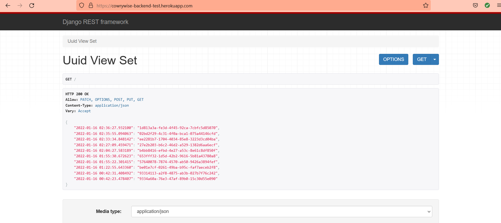

# Cowrywise Backend Job application test

> It is a simple **API** that does the following:

- [x] It returns a key-value pair of randomly generated UUID. Key is a timestamp and value is in UUID format.

- [x] While the server is running, whenever the API is called, it returns all the previously generated UUIDs alongside a new UUID. 


**Note**: **A deployed version of the aplication sits [here on Heroku](https://cowrywise-backend-test.herokuapp.com/)**

### Sample Image
<details>
<summary>Image showing the api response</summary>


</details>


## Built With

- [Python](https://www.python.org/)
- [Django](https://www.djangoproject.com/)
- [Django Rest Framework](https://www.django-rest-framework.org/)
- [PostgreSQL](https://www.postgresql.org/)


# Prequisites

1. Python 3.6 ++

2. Setup virtual environment. Visit [here](https://docs.python.org/3/library/venv.html) for a detailed guide on how to setup virtualenv.

3. Install the project requirements:
    ```sh
    $ pip3 install -r requirements.txt
    ```

4. Set up `.env` file, all the necessary environment variables can be found in `.env.example`. It is necessary to note the following during env setup:
    * SET timezone, e.g Africa/Lagos
    * SET postgreSQL database credentials or leave the fields empty to make use of db.sqlite3 database instead.


# Quickstart

**A deployed version of the aplication already sits [here on Heroku](https://cowrywise-backend-test.herokuapp.com/)**.

1. Run the migrations:
    ```sh
    $ python manage.py migrate
    ```
    This is necessary for creating the tables and propagating model changes in the database schema. It only needs to be run once for this application.

2. Start the application locally on your system and visit the localhost url provided to view the result.
    ```sh
    $ python manage.py runserver
    ```
3. Make a get, post, put or patch request to the localhost url or the [website](https://cowrywise-backend-test.herokuapp.com/) to view the result.   

4. Run the unittests written for the API. The tests are located in [uuid_generator/tests.py](uuid_generator/tests.py).
    ```sh
    $ python manage.py test
    ```

## Authors

**[Tawheed Oguntade](https://github.com/TWEEDOriginal/)**


